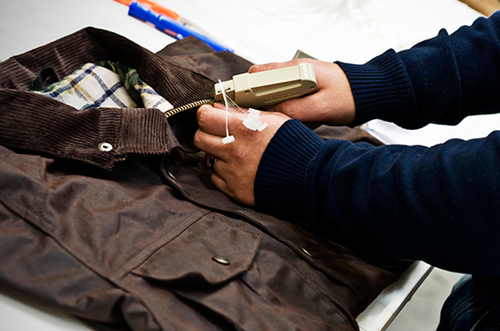
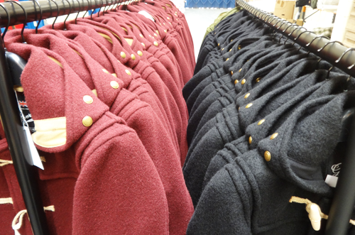
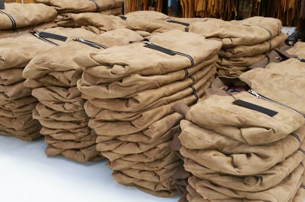
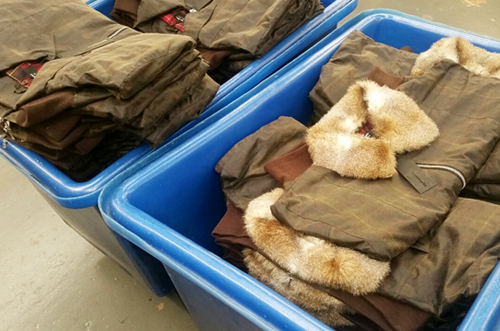

<!DOCTYPE html>
<html lang="en">
<head>

 
    <meta charset="UTF-8">
    <meta http-equiv="X-UA-Compatible" content="IE=edge">
    <meta name="viewport" content="width=device-width, initial-scale=1.0">
    <title>My first css program</title>

    
<h2>

ABOUT US:--
F Chand & Co is a UK based clothing manufacturer who has been supplying some of the world’s leading brands with hand crafted private label premium clothing production for over 40 years.

Since our incorporation in 1978 we have continued to successfully grow as a company and have a dedicated team of staff to ensure projects are fulfilled on time and to the clients required specification.

Our policy has always been to manufacture in house, overseeing every stage of production to ensure total control, flexibility and consistent manufacturing at all times.

</h2>

 

<h2> OUR FACILITY:--
F. Chand & Co has been operating from a 25,000 sq ft modern production facility since 2010 located in the heart of the Midlands and close to M5/M6 motorway links.

Our facility gives us the flexibility to offer our clients short lead times for both sampling and bulk orders.

Our production facility has been quality passed by some of the world’s leading brands.

</h2>

</head>
<body>
    
<h1>This is my first program FOR HOME PAGE </h1>

<h2> MANUFACTURING IN THE UK:--
F. Chand & Co is committed to assisting Private Label brands through the production process making it possible for them to reach their goals under expert guidance whilst benefiting from the ‘Made In Britain’ label.

We are constantly being contacted by clients wanting to bring production back to the UK and are desperate to have the ‘Made In Britain’ label.</h2>

 

<h2>
ETHICAL PRACTICES:--
This requirement is dictated by many factors such as the transparency our UK manufacturing offers with regards to ethical trading, supply chain and carbon emissions.

F Chand & Co has always supported ethical working / trading throughout its 40 year history. We work closely to ensure that we provide all of our staff with the best facilities and working environment.

We also take care to ensure that any and all trading that we do with third parties and international suppliers are within public frameworks and international guidelines of ethical working.

‘Made In the UK’ products carry large export appeal with consumers trusting our quality and craftsmanship.

</h2>

 

<h2> 
OUR ADDRESS IN UNITRED KINGDOM;--

F. Chand & Co

Unit 80 Middlemore Business Park
Middlemore Road
Smethwick
West Midlands
B66 2EP
United Kingdom

Tel: +44 (0)121 558 7726
Fax: +44 (0)121 565 3959
Email: info@fchand.co.uk

We at F. Chand & Co are continually looking to recruit personnel who can add both expertise and value to our company and encourage Production Managers, Sample/skilled Machinists, Pattern Cutters and designers to send their CV’s to info@fchand.co.uk

</h2>

 

<iframe width="900" height="900" src="https://youtu.be/vw7bMJjCl7Q" title="YouTube video player" frameborder="0" allow="accelerometer; autoplay; clipboard-write; encrypted-media; gyroscope; picture-in-picture" allowfullscreen></iframe>

https://youtu.be/vw7bMJjCl7Q

</body>
</html>
